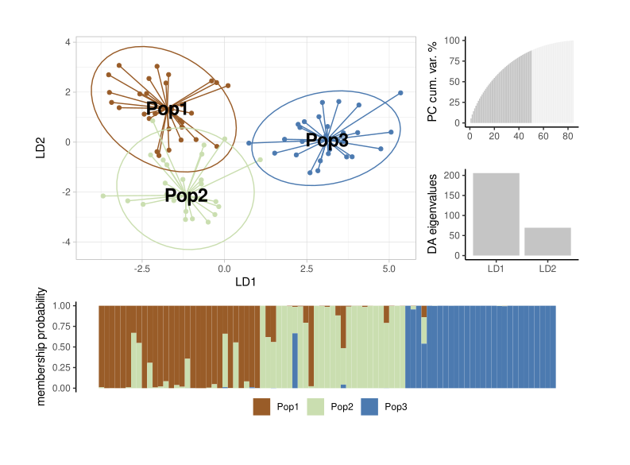

```{r setup, include=FALSE}
knitr::opts_chunk$set(echo = TRUE)
```

# DAPC analysis with ggplot2




This is a simple example of how to run a simple DAPC analysis with SSR or SNIP data.

For details about DAPC, see the `adegenet` package documentation and [Joumbart et al., (2010)](#References). 

DAPC analysis is very useful for the exploratory analysis of genetic data. It does not rely on Hardy-Weinberg equilibrium assumptions or other genetic models our data often breaks.

There are roughly two ways to run a DAPC analysis. But before get deeper into it, lets get the libraries we are going to use:


```{r, prompt=FALSE, results="hide", message=FALSE}
library("adegenet") # to run DAPC
library("tidyverse") # to use pipe %>% and other functions
library("ggplot2") # to get better plots
library("scico") # to get good scientific color pallets
library("patchwork") # to make good compositions
```

## Importing data 

The `adegenet` package accepts several types of data, but the GENEPOP is one of most popular for sure.    

```{r, echo=FALSE, prompt=F, message=FALSE, results='hide', render=F}
file <- "~/genepop.gen"
```

 > Make sure your file has .gen as extension.


After that, lets read it as an GENEPOP file with `read.genepop()` function, and create a summary of it.    

 > make sure to have `ncode` equal to the number of character used to code each alellel!

```{r, results="hide", warning=FALSE}
data <- adegenet::read.genepop(file, ncode = 3)
```

```{r}
data %>% summary # or summary(data)
```


# Runing a simple DAPC

The most straightforward way to run a DAPC is by considering the implicit data strata (pop grouping as provided in the GENEPOP file).

The analysis will then provides Discriminant Functions, giving the populations provided, to maximize the differentiation between the groups provided by the user.

> Note! In this analysis, we'll directly select Principal Components and Discriminant functions through the parameters `perc.pca` (% of cummulative var we wanna retain), `pca.select` (method to use % or n of PCs) and `n.da` (number of discriminant functions to retain). To see more, run `?dapc`.

```{r}
PopDapc <- dapc(data, perc.pca = 70, pca.select = "percVar", n.da = 2)
scatter(PopDapc)
```

We can see a simple plot with the individuals as dots plotted in the first two discriminant axis (y= DA1, x=DA2) colored by strata as provided in the GENEPOP file.


We can also run a `compoplot` (assignment barplot) for this analysis with the following lines:

```{r}
adegenet::compoplot(PopDapc) ## data %>% compoplot also works
```


## Plotting with ggplot2

There is nothing wrong with the original plots. There are great, but we can create more flexible plots with ggplot2.

Let's say you don't like the colors or the shape of either plot above, or that you would like to create a composition. Both tasks are few lines way with ggplot2

Of course it will require a bit more lines to get to, but you will have full control of every aspects of your plots

### Preparing the data to ggplot2

This is how the long-format data will looks like

```{r}
ggdapc <- 
  data.frame(PopDapc$ind.coord[,c("LD1","LD2")],
             Pop=PopDapc$grp) %>% 
  as_tibble() %>%
  group_by(Pop) %>%
  mutate(LD1.c=median(LD1), LD2.c=median(LD2)) %>% cbind(K = PopDapc$grp)

head(ggdapc)

```

This data has:
 - LD1 = eigenvalues for LD1 axis
 - LD2 = same for LD2
 - Pop = original strata
 - LD1.c = centroid for LD1 for each Pop
 - LD2.c = as as LD1.c for LD2.c
 
We will also get some values to help to positioning the "Pop"'s names

```{r}
##Getting the max values of each Pop
### ymax = max eigenvalues for y axis (LD2) in each Pop
ymax <- ggdapc %>% group_by(Pop) %>%
    filter(LD2 == max(LD2)) %>% 
    ungroup() %>% select(LD2) %>% unlist()

#centroids = the centroid value for each pop 
centroids <- ggdapc %>% group_by(Pop) %>% summarise(x=first(LD1.c), y=first(LD2.c))

cat("This is ymax: \n", ymax, "\n\n")
cat("This is the centroid data: \n")
centroids
```


```{r}
ggPopDapc <- 
  ggdapc %>% 
  ggplot(aes(x=LD1, y=LD2, color=Pop))+
    geom_point()+
    geom_segment(aes(x=LD1, xend=LD1.c, y=LD2, yend=LD2.c))+
    stat_ellipse()+
    theme_light()+
    geom_text(aes(x = x, y = y, label = Pop),
              data=centroids, color="black", 
              fontface="bold", size=6) +
    labs(x="LD1", y="LD2")+
  scale_color_scico_d(palette = "romaO", begin = 0.2, end = 0.8, aesthetics = "color")+
  theme(
    legend.position = "none"
  )

ggPopDapc
```


```{r}
#To see other pallets
#scico::scico_palette_show()

##To access PCs used
PopPCAvar <- data.frame(
  var = cumsum((PopDapc$pca.eig))/sum(PopDapc$pca.eig)*100,
  ret.pca = c( rep(TRUE,length(PopDapc$tab)), rep(FALSE, length(PopDapc$pca.eig)-length(PopDapc$tab)) ),
  pca = 1:length(PopDapc$pca.eig)
) %>%
  ggplot(aes(y=var, x=pca, fill=ret.pca))+
  geom_col(width = 1)+
  theme_classic()+
  scale_fill_scico_d(palette = "grayC", begin=0.05, end=0.2)+
  theme(
    legend.position = "none"
  )+
  labs(y="PC cum. var. %", x="")

#Create a DA plot
PopDAplot <- data.frame( 
  DA = colnames(PopDapc$loadings),
  values = PopDapc$eig,
  fill = "gray") %>% 
ggplot( aes(x=DA, y=values, fill=fill) )+
  geom_col()+
  theme_classic()+
  labs(y="DA eigenvalues", x="")+
  scale_fill_scico_d(palette="grayC", begin=0.2)+
  theme(legend.position = "none")

##ggCompoPlot
ggPopCompoplot <- 
PopDapc$posterior %>% as_tibble() %>% 
  mutate(ind = row_number()) %>%
  pivot_longer(cols=colnames(.)[-length(.)], names_to = "grp", values_to = "prob") %>%
  ggplot(aes(y=prob, x=ind, fill=grp)) +
  geom_col(position = "stack", width = 1) + 
  labs(y="membership probability", x="", fill="")+
  theme_classic()+
  theme(
    axis.line.x = element_blank(),
    axis.ticks.x = element_blank(),
    axis.text.x = element_blank(),
    legend.position = "bottom"
  )+
  scale_fill_scico_d(palette = "romaO", begin = 0.2, end = 0.8, aesthetics = "fill")

layout <- c(
  patchwork::area(t = 1, l = 1, b = 4, r = 3),
  patchwork::area(t = 1, l = 4, b = 2, r = 4),
  patchwork::area(t = 3, l = 4, b = 4, r = 4),
  patchwork::area(t = 5, l = 1, b = 6, r = 4)
)
ggPopDapc + PopPCAvar + PopDAplot + ggPopCompoplot +
  patchwork::plot_layout(design = layout)

```


## References

- Jombart, T., Devillard, S., & Balloux, F. (2010). Discriminant analysis of principal components: a new method for the analysis of genetically structured populations. BMC genetics, 11(1), 1-15.

