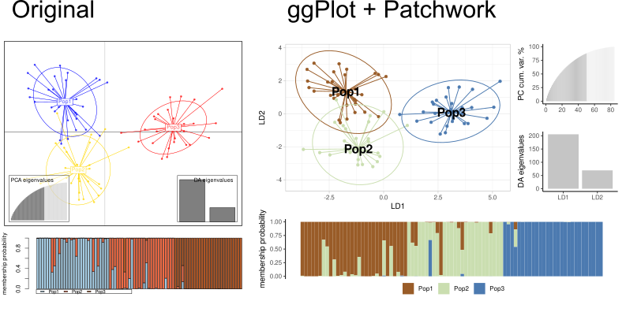

# ggDAPC

## A set of codes to plot DAPC with ggplot2

Discriminant Analysis of Principal Components (DAPC) from the Adegenet R package is a quite useful analysis to explore differences between sets of genetic data (SNIP or SSR data) without genetic model assumptions.

This chunk of code intends to compile a set of functions to help people to plot DAPC outputs in ggplot2 graphic grammar.
The ggplot2 package is quite flexible and users can customize these objects in several ways.

These scripts are based so far on the following packages:

 - **base R v4.1.1**    
  - **adegenet**: Exploratory Analysis of Genetic and Genomic Data    
  - **tidyverse**: a set of packages that work in harmony - for data wragling    
  - **ggplot2**: Create Elegant Data Visualisations Using the Grammar of Graphics    
  - **scico**: Colour Palettes Based on the Scientific Colour-Maps - colorblind friendly    
  - **patchwork**: The Composer of Plots - a ggplot2 arranger    

I recommend users take a look at the documentation of all these packages, but you don't have to do so for the script use.

See the comparison of output plot examples:

### How to use

[Take a look at a simple tutorial]("https://wilsonfrantine.github.io/ggDAPC/")

1. Download the DAPC.R file 
2. Open in your R editor software
3. change the path of the input file ('file' variable) to the one where is your genepop input file data.
4. Run the code!

### Important details

This script is just a simple pipeline based on functions stored at `ggDAPC.R` file.

The code runs two sets of analyses:

#### 1. A priori grouping as provided in the genepop input. 

   Usually, the "populations" as described by the user in the genepop input file. It is useful to see whether the data support sampling site separation as expected. See more in the Adegenet documentation

#### 2. Best K grouping giving the data.  

   Some tutorials indicate as the best practice try to find out the best grouping hypothesis given the data. The adegenet package has a function: find.best.k which provides some support to group individuals by bestK algorithm and Bayesian information criterion (see more in adegenet docs).
   This second option shows data considering the user-provided bestK grouping from find.cluster function.
    
### Disclaimer

Users must be sure about their choices on their own data. There is no warrant for this script.
You can change any parameters of the graph whenever you want.
