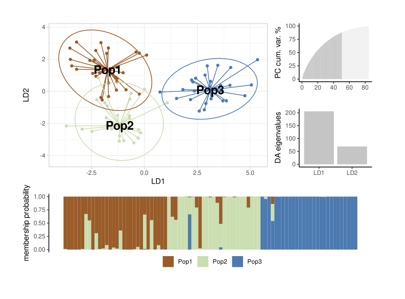

```{r setup, include=FALSE}
knitr::opts_chunk$set(echo = TRUE)
```

# DAPC analysis with ggplot2




This is a simple example of how to run a simple DAPC analysis with SSR or SNIP data.

For details about DAPC, see the `adegenet` package documentation and [Joumbart et al., (2010)](#References). 

DAPC analysis is very useful for the exploratory analysis of genetic data. It does not rely on Hardy-Weinberg equilibrium assumptions or other genetic models our data often breaks.

There are roughly two ways to run a DAPC analysis. But before get deeper into it, lets get the libraries we are going to use:


```{r, prompt=FALSE, results="hide", message=FALSE}
library("devtools")
devtools::source_url("https://raw.githubusercontent.com/wilsonfrantine/ggDAPC/main/ggDAPC.R")
```

## Importing data 

The `adegenet` package accepts several types of data, but the GENEPOP is one of most popular for sure.    

```{r, echo=FALSE, prompt=F, message=FALSE, results='hide', render=F}
file <- "~/genepop.gen"
```

 > Make sure your file has .gen as extension.


After that, lets read it as an GENEPOP file with `read.genepop()` function, and create a summary of it.    

 > make sure to have `ncode` equal to the number of character used to code each alellel!

```{r, results="hide", warning=FALSE}
data <- adegenet::read.genepop(file, ncode = 3)
```

```{r}
data %>% summary # or summary(data)
```


# Runing a simple DAPC

The most straightforward way to run a DAPC is by considering the implicit data strata (pop grouping as provided in the GENEPOP file).

The analysis will then provides Discriminant Functions, giving the populations provided, to maximize the differentiation between the groups provided by the user.

> Note! In this analysis, we'll directly select Principal Components and Discriminant functions through the parameters `perc.pca` (% of cumulative var we wanna retain), `pca.select` (method to use % or n of PCs), and `n.da` (number of discriminant functions to retain). To see more, run `?dapc`.

```{r}
PopDapc <- dapc(data, perc.pca = 70, pca.select = "percVar", n.da = 2)
scatter(PopDapc)
```

We can see a simple plot with the individuals (as dots) plotted in the first two discriminant axis (y= DA1, x=DA2) colored by strata as provided in the GENEPOP file.


We can also run a `compoplot` (assignment barplot) for this analysis with the following lines:

```{r}
compoplot(PopDapc) ## data %>% compoplot also works
```


## Plotting with ggplot2

There is nothing wrong with the original plots. They are great, but we can create more flexible plots with ggplot2.

Let's say you don't like the colors or the shape of either plot above, or that you would like to create a composition. Both tasks are a few lines away with ggplot2

Once we have sourced the `ggDAPC.R` file, it is simple like the lines bellow


```{r}
ggPopDapc <- ggDapc(PopDapc)
ggPopDapc
```

Same for the `compoplot`:

```{r, fig.height=3 }
popCompoplot <- ggCompoplot(PopDapc)
popCompoplot
```

Finally, we can create any plot combination by mixing plots or changing their properties with ggplot2 syntax. 

In the lines below we will create a layout to shape the plot area and then, we will create these plots, by calling their respective function:

```{r}
layout <- c(
  patchwork::area(t = 1, l = 1, b = 4, r = 3),
  patchwork::area(t = 1, l = 4, b = 2, r = 4),
  patchwork::area(t = 3, l = 4, b = 4, r = 4),
  patchwork::area(t = 5, l = 1, b = 6, r = 4)
)
plot(layout)
```

The layout is simple to understand. For example:     
`patchwork::area(t = 1, l = 1, b = 4, r = 3)`     
says that this plot will start at the top (t) and left (l) in the first cell and will end at the bottom (b = 4) and right (r = 3) in the fourth and third cells, respectively.

Now, to the actual plot... 

```{r}
ggDapc(PopDapc) + ggPCvar(PopDapc) + 
ggDAplot(PopDapc) + ggCompoplot(PopDapc) +
patchwork::plot_layout(design = layout)

```

That makes it simple


## References<a id="References"></a>

- Jombart, T., Devillard, S., & Balloux, F. (2010). Discriminant analysis of principal components: a new method for the analysis of genetically structured populations. BMC genetics, 11(1), 1-15.

